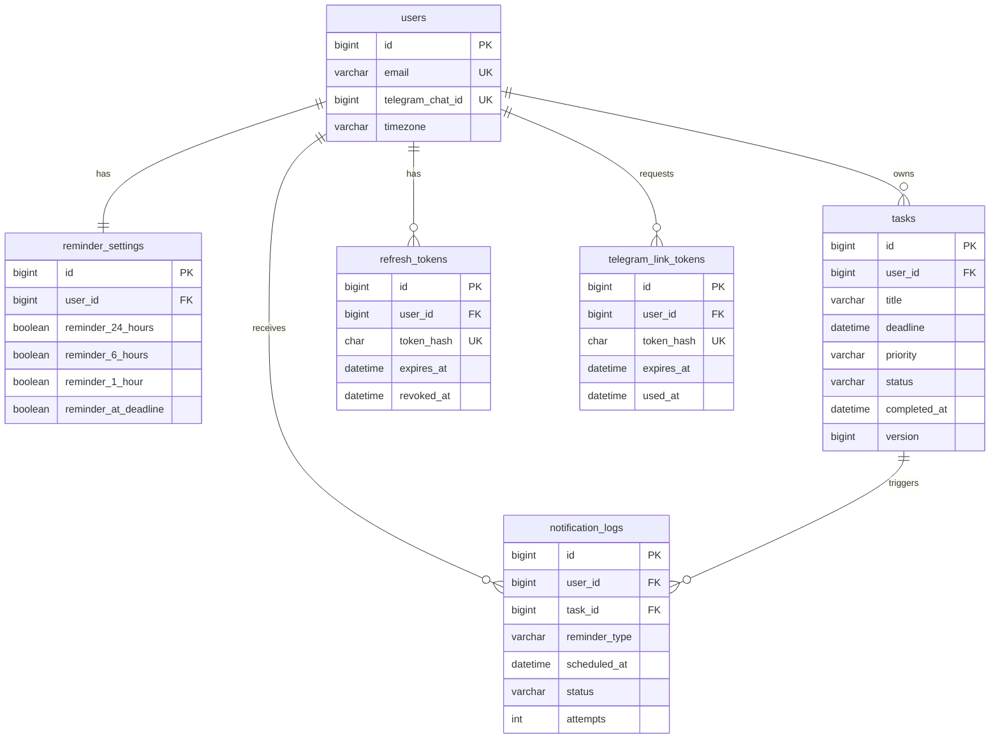

# ERD

Sumber: spec §6 dan §7 (kolom lengkap di [DATABASE_DESIGN.md](DATABASE_DESIGN.md)).

```mermaid
erDiagram
  users ||--|| reminder_settings : has
  users ||--o{ tasks : owns
  users ||--o{ refresh_tokens : has
  users ||--o{ telegram_link_tokens : requests
  users ||--o{ notification_logs : receives
  tasks ||--o{ notification_logs : triggers

  users {
    bigint id PK
    varchar email UK
    bigint telegram_chat_id UK
    varchar timezone
  }
  tasks {
    bigint id PK
    bigint user_id FK
    varchar title
    datetime deadline
    varchar priority
    varchar status
    datetime completed_at
    bigint version
  }
  reminder_settings {
    bigint id PK
    bigint user_id FK
    boolean reminder_24_hours
    boolean reminder_6_hours
    boolean reminder_1_hour
    boolean reminder_at_deadline
  }
  notification_logs {
    bigint id PK
    bigint user_id FK
    bigint task_id FK
    varchar reminder_type
    datetime scheduled_at
    varchar status
    int attempts
  }
  telegram_link_tokens {
    bigint id PK
    bigint user_id FK
    char token_hash UK
    datetime expires_at
    datetime used_at
  }
  refresh_tokens {
    bigint id PK
    bigint user_id FK
    char token_hash UK
    datetime expires_at
    datetime revoked_at
  }
```
